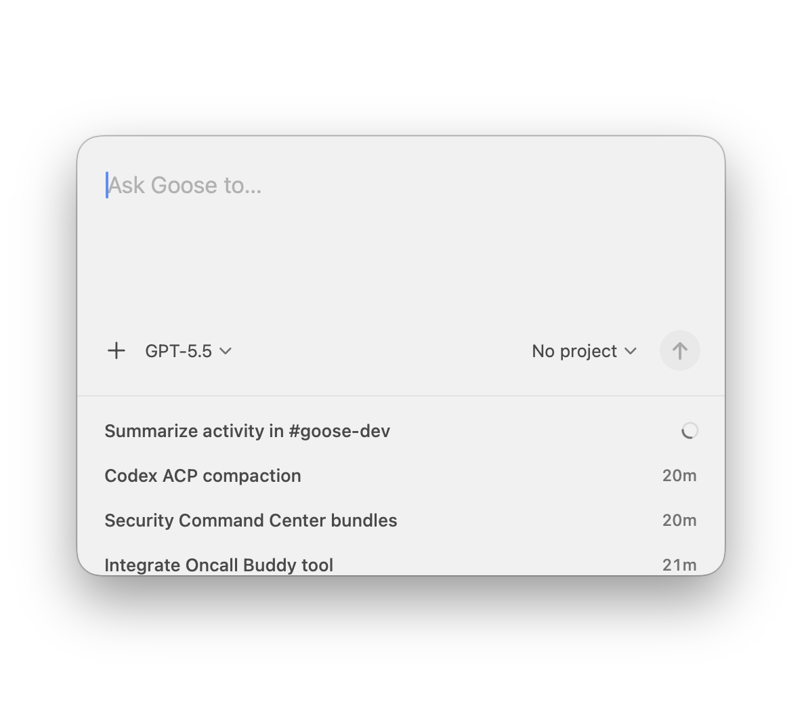

# catch

**catch** is a macOS shortcut for quickly finding and starting agent sessions in Goose, Codex, and Claude Code.



## Build And Run

Use the project-local macOS run script:

```bash
./script/build_and_run.sh
```

The script follows the Build macOS Apps workflow:

- stops any currently running `Catch` process
- builds the SwiftPM executable with `swift build`
- stages a macOS `.app` bundle at `~/Applications/Catch.app`
- launches the app bundle with `/usr/bin/open -n`

The Codex app Run action is wired to the same script through `.codex/environments/environment.toml`.

To launch the app in embedded-host mode:

```bash
GOOSE_SERVE_URL=ws://127.0.0.1:32845/acp?token=local-secret \
CATCH_GLOBAL_HOTKEY=alt+space \
  ./script/build_and_run.sh --embedded
```

Embedded mode connects to a host-provided Goose ACP server. The host should provide `GOOSE_SERVE_URL` with a non-empty `token` query item.

Embedded hosts may also pass `--global-hotkey <shortcut>` to let Catch register a native macOS global shortcut. The run script accepts `CATCH_GLOBAL_HOTKEY` and forwards it as that launch argument.

Embedded hosts may pass `--start-hidden` when restarting Catch after a configuration change. Catch will initialize normally but wait to show its panel until the global shortcut fires. The run script accepts `CATCH_START_HIDDEN=1` and forwards that launch argument in embedded mode.

To launch the separate test bundle for autonomous UI checks:

```bash
./script/build_and_run.sh --test
```

Autonomous test launches do not need a global shortcut.

Name the orange test-build banner with `CATCH_TEST_BUILD_LABEL`; the script forwards it as the app's `--test-build-label` launch argument:

```bash
CATCH_TEST_BUILD_LABEL="Session Picker" ./script/build_and_run.sh --test
```

To launch the same separate test bundle for manual testing, without the agent-only order-back behavior:

```bash
CATCH_TEST_BUILD_LABEL="Session Picker (Cmd-Ctrl-C)" \
CATCH_GLOBAL_HOTKEY=cmd+ctrl+c \
  ./script/build_and_run.sh --test-manual
```

When launching a test build that someone might manually test, pass `CATCH_GLOBAL_HOTKEY` so CatchTest registers a shortcut that does not conflict with any other running Catch instance. Prefer a Cmd-Ctrl shortcut, such as `cmd+ctrl+c`, but do not use `cmd+ctrl+x` because Codex uses that combo, and do not use `cmd+ctrl+v`. At minimum, do not use `alt+space` for manually testable test builds. Put the key combo in parentheses at the end of the orange banner title, such as `Session Picker (Cmd-Ctrl-C)`.

## Verification And Debugging

### SwiftUI Previews

Open the package in Xcode and select the `CatchKit` scheme before refreshing SwiftUI previews. `CatchKit` is exposed as a dynamic library product so previews can build through a framework scheme; using the `Catch` executable scheme can produce Xcode's `ENABLE_DEBUG_DYLIB` preview error.

### Build and run

```bash
./script/build_and_run.sh --verify
```

Builds, launches, and confirms the `Catch` process is running.

```bash
./script/build_and_run.sh --logs
```

Builds, launches, and streams unified logs for the app process.

```bash
./script/build_and_run.sh --telemetry
```

Builds, launches, and streams unified logs filtered to the app bundle identifier.

```bash
./script/build_and_run.sh --debug
```

Builds the app bundle and opens the app executable in `lldb`.

## Releases

Unsigned macOS release assets are produced by:

```bash
./script/package_release.sh 0.1.0
```

The script builds a universal `arm64` + `x86_64` executable and writes two assets to `dist/release`:

- `Catch-v0.1.0-macos-universal.dmg` for standalone installation
- `catch-v0.1.0-macos-universal.tar.gz` for Tauri sidecar embedding

Standalone users may need to allow the unsigned app in macOS Gatekeeper settings. Embedders should extract the tarball, verify the GitHub release asset digest, copy `catch` to the host app's expected sidecar filename, and launch it with `--embedded` plus a tokenized `GOOSE_SERVE_URL`, optionally `--global-hotkey <shortcut>`, and optionally `--start-hidden` for configuration-change restarts.

Publishing is automated by `.github/workflows/release.yml` for `v*` tags and manual workflow dispatch.
